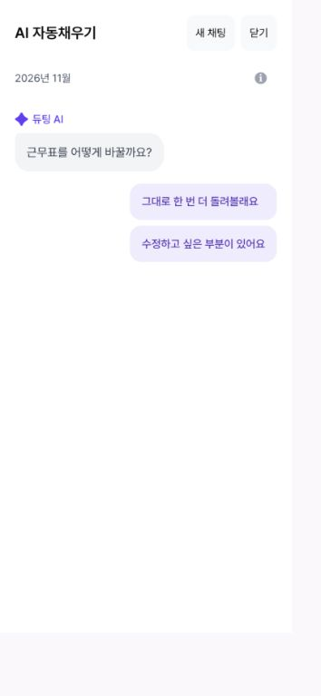
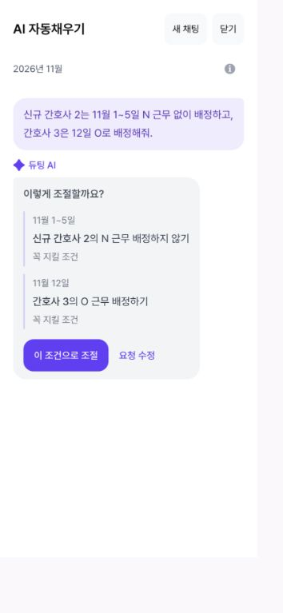
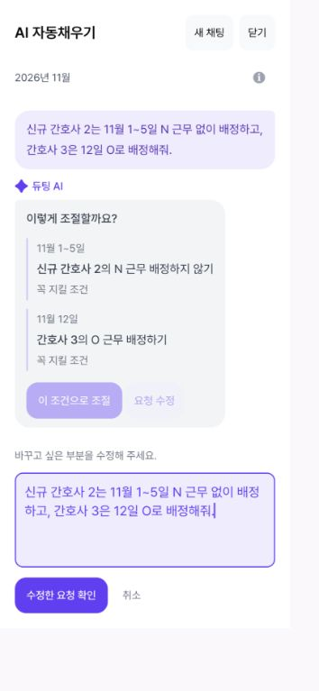
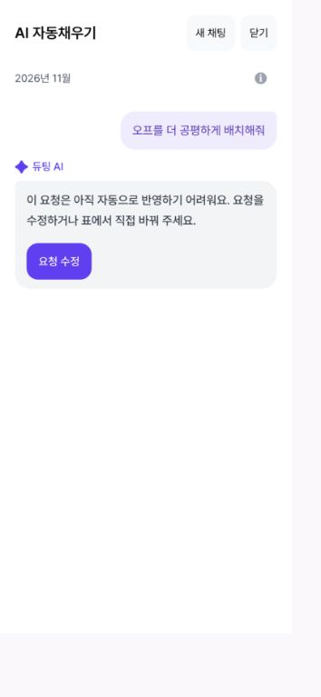

# AI 자동채우기 UIUX 복원 · 검토용 변경

2026-10-07 사용자가 develop 반영과 수간호사 사용 시나리오 검증을 승인했다. 아래의 반영 보류 기록은 그 이전 로컬 검토 단계의 상태다. 현재 전환은 develop에만 적용하며 main/운영은 변경하지 않는다. LLM 확인 질문은 실제 서비스의 기존 summary 계약으로 연결하고, 합성 미리보기 결과와 실제 모델·계산 결과를 구분해 검증한다.

## 최초 로컬 검토의 목적과 기준

사용자 피드백의 핵심은 기존 디자인과 동선을 검토 없이 바꾼 것이다. 비교 기준은 최신 develop fca1b880이며, e036f4d3의 통합 대화·복구, PR #47의 역사 근무표 미리보기를 보존한다. 별도 로컬 브랜치에서만 수정한다. develop push·PR 병합·개발계 설정 변경·배포는 사용자 검토 전 하지 않는다.

## 화면과 동선

1. 시작: 기존 `근무표를 어떻게 바꿀까요?`와 재생성/부분 수정 선택을 유지한다. SYSTEM/BRANCH 기록은 시작 여부 판단에 포함하지 않고 사용자 메시지로 출력하지 않는다.
2. 입력: 부분 수정 선택 후 질문과 입력창을 표시한다. 내부 서버 복구 버튼·전체 요청 재작성 경고·상시 선호 저장 버튼은 기본 화면에서 제거한다.
3. 확인: 기존 대화 말풍선과 보라색 행동 버튼을 유지한다. 대상·날짜·근무·강도를 사용자 문장으로 표시한다. `이 조건으로 조절` / `요청 수정`이 기본 행동이다. 확인과 계산은 서버에서 각각 수행하지만 한 번의 명시적 클릭으로 연결한다.
4. 수정: `요청 수정`은 해당 계획의 원문을 입력창에 채운다. 사용자는 날짜·사람·조건 중 바꿀 부분만 편집한다. 요청을 지우고 전체를 다시 쓰게 하지 않는다. 보존된 원문 전체를 REPLACE로 전송해 이전 조건의 조용한 소실이나 추측성 합치기를 피한다. 취소는 계획·표를 바꾸지 않는다.
5. 보류: 기술 실패는 재시도, 미지원은 요청 수정, 정보 부족은 서버의 구체 질문을 표시한다. 진단 코드·UUID·사건 번호는 사용자 화면에 표시하지 않는다. 자동 부분 실행은 하지 않는다.
6. 결과: 기존 결과 비교·반영·과거 표 미리보기·최종 확정 흐름을 유지한다. 문제 신고와 요청 저장 등 보조 기능은 접힌 보조 메뉴로 이동한다. 복구는 실제 복구 필요 상태에서만 제공한다.

## 디자인

레이아웃은 기존 407px 사이드바와 반응형 전체 폭을 유지한다. 기존 말풍선, 색상, 44px 이상 행동 버튼, 글꼴을 재사용한다. 시작 선택지는 흰색 테두리·아이콘·화살표 버튼으로 채팅과 구분한다. 실행 주 행동은 보라색, 보조 행동은 글자 버튼으로 구분한다. 입력 영역은 한 개의 접근 가능한 라벨과 placeholder를 두고, 첫 수정 질문에는 기존처럼 클릭 가능한 예시 3개를 제공한다. 여백을 새 제어로 채우지 않는다. 기존 조건 도구 설명은 유지하되 긴 목록의 읽기와 줄바꿈을 개선한다.

## 구현 경계

새 자연어 대화 참조·기존 GOAL 지원 복원은 엔진 기능이며 UI 변경으로 구현했다고 주장하지 않는다. 입력창의 원문 편집으로 사용자 재작성 부담을 제거한다. planHash·revision·sourceVersion·고정 셀·멱등 실행·결과 조건 검증을 유지한다. 확인 응답이 유실되거나 실행 전 표/대화가 바뀌면 계산하지 않는다. 사용자가 보는 화면에 맞추기 위해 검증을 우회하지 않는다.

## 검토와 검증

- 실제 SYSTEM/BRANCH 반환을 가진 새 채팅에서 시작 안내와 선택이 보이는지 확인.
- 한 문장의 날짜만 고칠 때 나머지 조건을 보존하고 취소 시 실행하지 않는지 확인.
- 한 번의 클릭이 정확한 planHash 확인 → 최신 확인 ID로 실행에 연결되는지, 실패·동시 변경·더블 클릭에 실행하지 않는지 확인.
- 미지원/기술 실패 상태에서 확인·실행하지 않고 적절한 행동을 제공하는지 확인.
- 기존 sidebar·진입·준비·스냅샷 테스트, 타입 검사와 빌드 수행.
- 실제 제품 컴포넌트와 합성 응답만 쓰는 로컬 미리보기에서 시작/확인/수정/보류/결과/모바일 화면을 검토. 실제 고객 요청·데이터·LLM API·개발 서버는 사용하지 않는다.

## 초기 로컬 검토 기록 (후속 수정 이전)

로컬 검토 화면: http://127.0.0.1:4176/tests/integration/ai-ux-review.html?scene=review

검토 상태 선택은 이 문서의 링크로만 제공한다. 근무표 화면 위에는 검토 도구나 상태 선택 메뉴를 표시하지 않는다. `요청 수정` → 원문의 날짜만 수정 → `수정한 요청 확인` → `이 조건으로 조절` → 전후 비교를 실제 제품 컴포넌트에서 확인할 수 있다. 화면의 요청 해석·계산 응답은 메모리 안의 합성 응답이다. 실제 이해 정확도나 계산 성능 검증 결과로 취급하지 않는다.

실행: 웹 worktree에서 `pnpm --dir apps/app exec vite --config tests/integration/vite.conversation.config.ts`.

- 관련 17개 테스트 파일 202개 통과. 이중 클릭 회귀 추가 후 sidebar 32개 통과(기존 31개 + 추가 1개).
- 타입 검사와 웹 빌드 통과. 데스크톱 1440×900, 모바일 390×844에서 확인·편집·취소·보류·재시도·반영을 확인했다.
- 새 채팅은 실제 서버와 같은 SYSTEM/BRANCH 사건을 사용해도 UUID 없이 시작 안내를 표시한다.
- 한 번의 명시적 클릭으로 확인과 계산을 연결하고, 확인 응답 유실·리비전 변경·이중 클릭·편집 중 실행을 차단한다.
- 일반 입력 화면에서 상시 복구 버튼·전체 재작성 안내·비활성 저장 버튼을 제거했다. 기존 과거 표 미리보기와 자동채우기 준비 절차는 변경하지 않았다.
- 수정은 로컬 `fix/ai-chat-ux-review`에만 있다. 서버 코드·DB·개발계 기능 설정·배포·develop 반영 없음.

아래 이미지는 초기 검토 기록이다. 이후 시작 선택을 흰색 테두리·아이콘 버튼으로 구분했고 입력 예시 및 실제 LLM 연결도 수정했다. 아래 이미지를 최종 화면으로 보지 않는다.

## 검토 화면 후속 수정

- 수간호사 사용 시나리오 검토에서는 질문에 답할 때 이전 요청 전체가 사용자 말풍선에 반복되는 점과, 조절 완료 뒤 질문 없이 입력창만 나타나는 점도 확인했다. 모델에는 전체 요청을 보존하되, 이미 표시된 원문과 일치하는 맥락 접두사만 화면에서 생략해 새 답변만 표시한다. 완료 후에는 `더 바꾸고 싶은 점이 있나요?`를 표시해 다음 입력의 맥락을 설명한다.

- 제한된 로컬 문장 처리기에서 해석되지 않는 입력을 즉시 `UNSUPPORTED`로 끝낸 것이 사용자가 요구한 LLM 전달 흐름과 달랐다. 같은 사용자 예문을 개발계 실제 semantic-preview에 합성 명단으로 보내면 5.39초 후 `NEEDS_CLARIFICATION`(근무 유형 미확정)이며, 실제 서비스는 처음부터 LLM 해석을 수행한다. 로컬 검토에서는 명시적 예시 문장 처리에 실패하면 기존 개발계 Gemini 서비스를 사용해 한 번 해석한다. 로컬 전용 bridge가 기존 추출 계약·독립 검증을 재사용하고, 같은 응답에 짧은 확인 질문을 받을 수 있도록 한다. 모호한 '근무 삭제'를 임의로 O 배정이나 N 제외로 바꾸지 않는다. 모델 10초/전체 요청 18초 예산을 두고 반복 호출은 하지 않는다. 개발계 코드·환경·DB·배포는 변경하지 않고, API 키를 로컬로 복사하지 않는다. 실제 모델 해석과 합성 표 변경을 구분해 검토하며, 서비스의 승인·실행 계약은 우회하지 않는다.
- 연결과 모델 서비스를 재사용한 뒤 같은 모호한 요청은 전체 2.04초(모델 1.957초)에 빈칸/휴무를 확인하는 질문을 반환했다. 이어서 원문과 `추가 답변: O로 배정해줘.`를 함께 전달하면 전체 2.31초(모델 2.292초)에 간호사 1·11월 1~5일·O 배정 하나만 확인됐고, 독립 grounding/coverage/compile 검사도 통과했다. 두 번의 실측이며 p95나 일반적인 성능 보장이 아니다.
- 확인 질문 상태에서는 입력창을 바로 제공한다. 짧은 답변은 이전 요청을 함께 전송하여 대상·기간·다른 조건을 잃지 않는다. 원문 재시도에는 답변 접두사를 붙이지 않는다. 질문 답변은 확인·실행을 자동으로 수행하지 않는다. 관련 sidebar 33개, UI 전체 동선 1개, 입력 fixture 8개 테스트를 통과했다(sidebar는 원문 재시도 회귀를 고친 뒤 별도로 다시 검사).
- 해석은 실제 Gemini지만 표 변경은 계속 로컬 합성 응답이다. 합성 변경이 구현하지 않은 COUNT를 FORBID로 오인해 성공으로 표시하지 않도록 실행을 차단한다. 실제 계산·제약 품질은 기존 서비스 경로에서 별도 검증해야 한다. 질문 생성 프롬프트 확장과 bridge는 로컬 검토용이며 서버 배포는 하지 않았다.

- 최신 원격 develop fca1b880의 기존 `ai-adjust-text-input`에는 `이렇게 요청해 보세요` 제목과 클릭 가능한 예시 3개가 있다. 새 `ai-conversation-sidebar`에는 이 UI가 옮겨지지 않아 placeholder 1개만 남았다. 첫 수정 질문 아래에 기존 형태의 예시 버튼 3개를 복원하고, 실제 행 순서의 간호사 이름·해당 달 날짜·병동 근무 종류를 사용한다. 기간 내 특정 근무 제외, 특정 날짜 휴무 배정, 특정 날짜 근무 배정으로 현재 확인된 배정/제외 기능을 안내한다. 기존 공평성·패턴 예시는 현 의미 계획의 지원 여부가 확인되지 않아 광고하지 않는다. 예시 클릭은 입력·포커스만 하고 해석·계산하지 않는다. 전송 이후/원문 편집 중에는 예시가 나오지 않고, 새 채팅에서 다시 제공한다. 시작의 두 선택지와 예시를 동시에 띄우지 않는다.
- 예시 복원 후 sidebar 32개와 전체 검토 동선 1개 테스트를 통과했다. 명단·근무 종류·날짜에 맞는 예시 3개, 클릭 후 입력·포커스, 클릭만으로 해석·실행되지 않는 동작을 검사했다. 타입 검사·ESLint·Prettier와 HTTP 200을 확인했다. 실제 브라우저 화면을 이번에 직접 검증한 결과는 아니다.

- 로컬 adapter가 간호사 2의 N 제외와 간호사 3의 O 배정을 고정 반환해, `간호사 1 5일까지 N 없게 해줘.`에도 다른 사람의 조건을 표시했다. 검토 입력에 맞는 응답을 만들지 않은 fixture 결함이다. 지원하는 명시적 이름·날짜·근무의 배정/제외 문장만 제한적으로 읽어 해당 조건을 반환한다. 범위 밖 문장은 확인·실행을 허용하지 않고 다른 예시 조건으로 대체하지 않는다. 이 로컬 입력 처리기는 실제 LLM 정확도 검증이나 서비스의 자연어 기능 구현이 아니다. 입력 조건과 결과 셀의 대상도 함께 검사한다.
- 입력 fixture 8개와 전체 동선 1개 테스트를 통과했다. 사용자가 입력한 간호사 1 요청은 조건 1개만 표시하고, 실제 로컬 표에서 해당 간호사의 1~5일 N만 제거하며 다른 행과 6일 이후는 유지되는 것을 검사했다. 잘못된 월·날짜·이름이나 지원하지 않는 추가 조건은 전체 계획을 막는다. 웹 타입 검사와 로컬 페이지·모듈 HTTP 200도 확인했다. 실제 AI 서비스의 이해 정확도와 근무표 품질은 이 결과로 검증되지 않는다.

- 입력창이 대화와 떨어진 업무 폼처럼 보이는 문제도 정리한다. 시작 시에는 입력창을 숨기고, 수정 선택의 질문 뒤에만 입력을 받는다. 기존 `ai-adjust-text-input`과 같은 14px 둥근 테두리·입력 영역 안의 전송 아이콘을 사용한다. 별도 `수정할 내용` 제목이나 전체 요청 재작성 안내를 다시 넣지 않는다. 편집 모드의 원문 보존·취소와 전송의 접근 가능한 이름은 유지한다.
- 입력 영역 변경 후 sidebar 32개와 전체 검토 동선 1개 테스트, 타입·ESLint·Prettier 검사를 통과했다. 시작 시 입력·복구·저장 버튼이 숨겨지고 수정 선택 후 질문과 입력창이 이어지는 상태도 검사했다. 실제 브라우저에서 이번 입력 디자인을 직접 확인한 결과는 아니다.

- 시작 화면의 두 선택지가 사용자 채팅과 같은 오른쪽 정렬·보라색 배경·말풍선 형태를 써 행동 버튼으로 구분되지 않았다. 대화와 선택 영역 사이에 얇은 구분선을 두고, 선택지는 전체 폭의 흰색 테두리 버튼과 작업 아이콘·오른쪽 화살표로 표시한다. 선택 전에는 행동 영역, 선택 후에는 기존 사용자 말풍선으로 남긴다. 문구와 선택 이후 동작은 유지한다. 새 메뉴나 추가 단계를 만들지 않는다.
- 선택 영역 변경 후 entry/sidebar 관련 34개 테스트와 타입 검사, 변경 컴포넌트 ESLint·Prettier 검사를 통과했다. 로컬 미리보기 HTTP 200을 확인했다. 이번 변경의 실제 브라우저 화면은 직접 검증하지 못했다.

- 사용자가 지적한 근무표 위 `시작` 등 검토 메뉴를 제거했다. [시작 화면](http://127.0.0.1:4176/tests/integration/ai-ux-review.html?scene=start), [확인](http://127.0.0.1:4176/tests/integration/ai-ux-review.html?scene=review), [미지원](http://127.0.0.1:4176/tests/integration/ai-ux-review.html?scene=unsupported), [일시 오류](http://127.0.0.1:4176/tests/integration/ai-ux-review.html?scene=failure) 링크는 문서에서만 선택한다.
- 이전 미리보기 서버가 종료되어 페이지 전환이 실패했다. 로컬 서버를 별도 세션으로 실행해 HTTP 200과 부모 프로세스가 종료된 뒤에도 서비스가 계속되는 것을 확인했다. 개발계 서버는 변경하지 않았다.
- 합성 adapter가 GENERATE 요청에도 ADJUST 결과를 반환하던 계약 오류를 수정했다. 새 채팅의 리비전/원본 표도 실제 계약에 맞췄다.
- 검토 페이지 전체의 재생성 → 새 채팅 → 조건 수정 → 조절 → 닫기/다시 열기를 UI 통합 테스트로 검사한다. 이 테스트는 합성 응답만 사용한다.
- 이번 후속 수정에서는 브라우저 도구의 주소 정책이 로컬 탭 접근을 거부했다. 새 화면을 브라우저에서 직접 검증하거나 새 스크린샷으로 확인했다고 주장하지 않는다. 위 모바일 이미지는 이전 수정 때 촬영한 사이드바 화면이다.

## 10월 7일 추가 검증

확인 질문 답변뿐 아니라 적용 후 짧은 추가 요청에도 이전 요청의 조건을 유지해 실제 LLM에 함께 전달한다. UI에는 추가 답변/요청만 말풍선으로 표시한다. 명시적인 전체 요청 수정은 이전 문장을 중복 결합하지 않는다. 동일한 500자 계약 안에서 처리하며 초과 시 줄이지 않고 입력을 유지한다.

로컬 검토 화면의 사용자가 입력한 요청은 모두 개발 서버의 실제 semantic-preview를 호출한다. 로컬 문장 파서는 화면 예시 상태 및 단위 테스트 fixture용으로만 남긴다. 별도 프롬프트·응답 계약으로 실제 서비스와 다른 답을 만드는 bridge는 제거한다. 로컬 표 변경은 합성 날짜별 배정·제외 시연이며 실제 CP-SAT 실행의 증거로 계산하지 않는다.

입력 힌트도 예시와 같은 실제 행 순서·현재 날짜·병동 근무 코드를 사용한다. 2교대 N12 병동에 N을 고정해서 제안하지 않는다. 지원 근무 유형이 없는 경우 일반 입력 안내를 표시한다.
